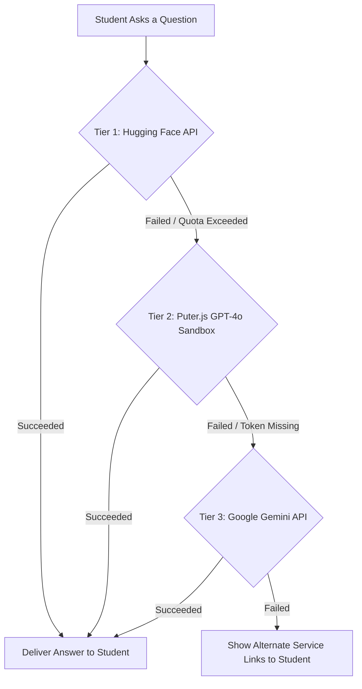

# PastQ — AI-Powered Academic Tutoring Platform 🎓🤖

> **Live at → [pastqhub.com](https://pastqhub.com)**

PastQ is a premium, state-of-the-art educational platform designed to help students master past examination papers using cutting-edge Artificial Intelligence. It combines an immersive PDF viewing experience with specialized AI tutoring that "decodes" papers, providing instant insights, summaries, and deep-dive explanations.

---

## 🚀 Key Features

### 📖 Immersive Paper Viewer
- **Smart Reading**: High-performance PDF viewer with integrated study tools.
- **Tutor Insights**: A dedicated sidebar that reveals AI-generated summaries, key focus areas, and "hardest question" solutions.
- **Reveal Mechanism**: Advanced logic that handles on-demand insight generation while maintaining a global cache for speed.

### 🤖 Multi-Tier AI Tutor Chat & OCR
- **Context-Aware**: The AI knows exactly which paper you are reading and answers questions based on the document text.
- **High-Resiliency Multi-Tier AI**: A rock-solid, multi-engine fallback pipeline ensures the tutor is always online even during primary API blackouts.
- **Integrated OCR Engine**: Automatic detection of scanned or unreadable PDFs with local and cloud OCR pipelines.

### 💼 Student Dashboard
- **Browse & Filter**: Advanced filtering by academic year, semester, and department.
- **Visual Active Tabs**: Active visual indicator states on the subject tabs, improving navigation feedback.
- **Smart Empty States**: Intuitive "Not Found" feedback with quick-reset filter capabilities for a seamless browsing experience.
- **Progress Tracking**: Statistics on AI usage, plan status, and study sessions.
- **Session Management**: Persistent chat histories that allow students to resume their tutoring sessions across different papers.
- **Premium Tiers**: Role-based access control for Basic, Plus, and Pro subscription plans.

### 📱 Progressive Web App (PWA)
- **Installable**: Users can install the platform directly to their device home screens for a native app-like experience.
- **Smart Prompts**: Intelligent installation prompts that gracefully hide themselves once the app is installed or dismissed.
- **Adaptive Icons**: Fully optimized maskable icons for Android and iOS.

### 💎 Premium User Experience (UX)
- **Cohesive Custom Modals**: Removed all archaic, blocking browser `window.alert` dialogs, replacing them with a non-blocking `AlertModal` matching the platform's custom dark-theme styling.
- **State-Adaptive Landing Page**: CTA blocks conditionally hide redundant pathing once authenticated, keeping the home screen clean with a single "Browse Papers" button for logged-in users while retaining standard sign-up flows for visitors.
- **True Account Isolation**: Comprehensive session and local database teardown on logout to ensure zero data bleeding (streaks, study stats, bookmarks) when switching profiles on shared computers.

### 🔒 Advanced Security & Session Management
- **Single-Device Login**: Strict concurrent session control. If a user logs into a new device, any older active sessions are instantly invalidated and the user is presented with a professional expiry notification.
- **Smart Storage**:
  - *Browser Users*: Temporary session storage that automatically logs out on exit for shared computers.
  - *App/PWA Users*: Persistent local storage featuring a rolling 7-day authentication window for uninterrupted daily study sessions.

### 🛡️ Admin HQ Portal
- **Centralized Management**: Full control over papers, subjects, and student records.
- **Bulk Upload Workflow**: High-efficiency spreadsheet-style interface for uploading hundreds of papers simultaneously with real-time duplicate detection.
- **Form Draft Persistence**: Admin upload/add forms (Papers & Subjects) automatically save to `localStorage` as you type. If the page refreshes accidentally, the modal re-opens with all fields restored — only the file picker must be re-selected (browser security restriction). A clear notice is shown to remind the admin.
- **Payment Report Export**: The Revenue & Transactions page features a fully functional **Export Report** button that generates and downloads a UTF-8 CSV file (`payment_report_YYYY-MM-DD.csv`) covering all transaction records (Transaction ID, Student Name, Email, Plan, Amount, Status, Date) with proper comma and quote escaping for Excel compatibility.
- **Failed Join Attempts Monitor**: Comprehensive logging and real-time dashboard monitoring of registration failures (validation errors, blocked domains, database issues, email dispatch failures) with live admin notifications.
- **Searchable Logging Panels**: Dynamic live search filters across both **Recent Deletions** and **Failed Join Attempts** lists, enabling instant lookup by email, name, or failure reason.
- **Permanent Log Dismissal**: Support for dismissing deletion logs and failed registration logs, permanently deleting them from the database directly from the dashboard UI.
- **AI Health Monitoring**: Real-time status indicators for API quota and processing status.
- **Live Processing Logs**: Visual feedback for background PDF analysis and insight generation.

### 🔒 AI Academic Guardrails (Strict)
- **Off-Topic Refusal**: The PastQ AI Tutor is strictly restricted to academic, educational, and course-related topics.
- **Zero Leakage Policy**: The AI is explicitly forbidden from including **any** answer, score, result, fact, or detail for an off-topic query inside its refusal. Non-academic queries receive a polite refusal and an invitation to ask an academic question — nothing more.
- **Broad Scope**: Covers sports scores, celebrity gossip, pop culture, movies, music, gaming, general leisure trivia, and all other non-academic topics.
- **Single Control Point**: Enforced at the very top of `buildSystemInstruction()` in `server/src/routes/ai.ts`, which is shared by all three AI provider tiers (HuggingFace, Puter, Gemini).

---

## 🤖 AI Fallback Architecture (Detailed)

PastQ relies on a state-of-the-art redundancy routing matrix to bypass network failures, API outages, and usage limits.

### A. Student Chat Router (`POST /ai/chat`)
Interactive student chats prioritize high-quality open-weights models before falling back to sandbox utilities and commercial APIs:



1. **Tier 1: Hugging Face Inference API (Primary)**
   Attempts to resolve the question using high-performance open-weight models sequentially. If one fails, the router seamlessly hops to the next in real-time:
   * **Model A**: `meta-llama/Llama-3.3-70B-Instruct`
   * **Model B**: `Qwen/Qwen2.5-72B-Instruct`
   * **Model C**: `deepseek-ai/DeepSeek-V3`
   * **Model D**: `mistralai/Mistral-7B-Instruct-v0.3`
2. **Tier 2: Puter.js GPT-4o Sandbox (First Fallback)**
   If Hugging Face is unreachable or keys are exhausted, the server switches to Puter API sandbox utilizing `gpt-4o`.
3. **Tier 3: Google Gemini API (Last Resort)**
   If other channels fail, Gemini (`gemini-2.0-flash`, `gemini-2.0-flash-lite`, `gemini-2.5-flash`) acts as a highly capable last line of defense.

---

### B. Static Paper Insights Generator
For heavy, asynchronous background analysis of uploaded exam papers, the order is optimized for bulk speeds:
1. **Google Gemini** (Primary - utilizes advanced document context windows)
2. **Puter.js** (First Fallback)
3. **Hugging Face** (Second Fallback)

---

## 🔍 OCR Pipeline & `eng.traineddata`

All exam PDFs — whether fully scanned, fully digital, or hybrid — are automatically analysed and routed through our intelligent OCR pipeline to ensure AI answers are always grounded in the real paper content.

### Shared OCR Utility: `server/src/lib/ocr.ts`
The entire OCR logic lives in a single, reusable module (`ocr.ts`) exported as `performOcrPipeline(pdfBuffer, numPages)`. Both the **student chat router** (`POST /ai/chat`) and the **background insights generator** (`generatePaperInsights`) import from this shared utility, guaranteeing consistent behaviour everywhere.

### Hybrid PDF Detection (Critical Fix)
University exam papers frequently follow a **hybrid layout**: the cover page (university name, instructions, date) is digitally typed (selectable text), while subsequent pages containing the actual questions are scanned images. Previously, `pdf-parse` would extract the cover page text (>50 chars) and the system would incorrectly conclude the PDF was fully readable — skipping OCR entirely and sending only the cover page to the AI, which then reported *"there are no questions in this paper"*.

The detection logic now uses a **characters-per-page average threshold** to catch this case:

```
avgCharsPerPage = extractedText.length / numPages

isHybridOrScanned = (extractedText.length < 50) OR (avgCharsPerPage < 250)
```

| Condition | Interpretation | Action |
|---|---|---|
| `extractedText < 50 chars` | Fully scanned (zero selectable text) | Trigger OCR |
| `avgCharsPerPage < 250` | Hybrid — only cover page is typed | Trigger OCR |
| `avgCharsPerPage ≥ 250` | Fully digital paper | Use pdf-parse text directly |

### Page Limit — Expanded from 5 → 12
The previous hard-coded limit of **5 pages** caused questions on pages 6–10 to be silently truncated. The pipeline now renders up to **12 pages** dynamically based on the PDF's actual page count, ensuring long papers with 6–12 pages of questions are fully captured.

### The OCR Workflow
1. **Parse**: `pdf-parse` extracts selectable text and the total page count (`numpages`).
2. **Hybrid Check**: Average characters-per-page is calculated. If below `250`, the paper is flagged for OCR.
3. **Image Rendering**: `unpdf` + `@napi-rs/canvas` render up to `min(numPages, 12)` PDF pages to PNG images at 1.5× scale.
4. **Primary OCR**: Images are sent to **Google Cloud Vision API** (`DOCUMENT_TEXT_DETECTION`) in a single batch request.
5. **Local Backup OCR**: If Vision credentials are missing or the API fails, **Tesseract.js** processes each page image locally.
6. **Result**: Fully assembled OCR text (one block per page) replaces `extractedText` and is sent to the AI provider.

### What is `eng.traineddata`?
* **Definition**: `eng.traineddata` is the Tesseract English Language Dataset containing the neural network LSTM model and character classification data needed to perform offline text recognition.
* **Generation**: Tesseract.js automatically downloads this `~5 MB` dataset from the official `tessdata` CDN during its first run on the backend.
* **Storage Location**: Cached in the backend process root (`/server/eng.traineddata`).
* **Version Control**: This is a runtime cache file. It is **excluded** in both `/server/.gitignore` and the root `/.gitignore` via the `*.traineddata` glob pattern. Do **not** commit it to Git.

---

## 🛠️ Tech Stack

- **Frontend**: React 19, TypeScript, Vite, Tailwind CSS, Framer Motion.
- **Backend**: Node.js, Express, TypeScript.
- **Database**: Supabase (PostgreSQL) + Auth.
- **Cache & Rate Limiting**: Upstash Redis (REST client) + `@upstash/ratelimit`.
- **File Storage**: Cloudflare R2 (S3-Compatible) for ultra-fast PDF delivery.
- **AI Models**: Hugging Face Serverless APIs + Puter.js SDK + Google Gemini API.
- **OCR Engine**: Google Cloud Vision + Tesseract.js.
- **Payments**: Paystack Integration.
- **Hosting**: Vercel (Frontend) + Render (Backend).

---

## 🌐 Custom Domain Setup — `pastqhub.com`

This section documents how to connect the custom domain **pastqhub.com** to the Vercel-hosted frontend.

### Step 1 — Add the Domain in Vercel

1. Go to your [Vercel Dashboard](https://vercel.com/dashboard) and open the **PastQ** project.
2. Click **Settings** → **Domains**.
3. Type `pastqhub.com` and click **Add**.
4. Also add `www.pastqhub.com` and configure it to **redirect to** `pastqhub.com` (canonical).

Vercel will display the DNS records you need to add next.

---

### Step 2 — Configure DNS at Your Registrar

Log in to wherever you purchased `pastqhub.com` (e.g., Namecheap, GoDaddy, Cloudflare, Google Domains) and add the following DNS records:

#### Option A — Apex domain (`pastqhub.com`) via A Records
| Type | Host / Name | Value | TTL |
|------|-------------|-------|-----|
| `A` | `@` | `76.76.21.21` | Auto |
| `CNAME` | `www` | `cname.vercel-dns.com.` | Auto |

#### Option B — Using Cloudflare as DNS (Recommended for performance)
If your domain is on Cloudflare, use these records and **disable the orange proxy** (grey cloud / DNS-only) for the apex `A` record — Vercel handles SSL itself:
| Type | Name | Content | Proxy |
|------|------|---------|-------|
| `A` | `@` | `76.76.21.21` | DNS Only ☁️ |
| `CNAME` | `www` | `cname.vercel-dns.com` | DNS Only ☁️ |

> **Note**: DNS propagation can take anywhere from a few minutes to 48 hours. You can check propagation status at [dnschecker.org](https://dnschecker.org).

---

### Step 3 — SSL Certificate (Automatic)

Vercel automatically provisions and renews a **free TLS/SSL certificate** via Let's Encrypt once it detects the correct DNS records. No action needed on your part — just wait for the green checkmark in the Vercel Domains panel.

---

### Step 4 — Update Environment Variables

Once the domain is live, update these values in your **Vercel project environment variables** (Settings → Environment Variables):

```env
# Frontend (.env / Vercel env)
VITE_API_URL=https://your-render-backend.onrender.com/api

# Backend (Render env)
FRONTEND_URL=https://pastqhub.com
```

And in **Supabase** → Authentication → URL Configuration:
- **Site URL**: `https://pastqhub.com`
- **Redirect URLs**: Add `https://pastqhub.com/auth/callback`

---

### Step 5 — Update `robots.txt` & Sitemap

A `sitemap.xml` is already included in `/public/sitemap.xml` with all public routes. Make sure your `robots.txt` references it. Create `/public/robots.txt` if it doesn't exist:

```
User-agent: *
Allow: /

Sitemap: https://pastqhub.com/sitemap.xml
```

After deploying, verify Google can reach your sitemap at:
`https://pastqhub.com/sitemap.xml`

Then submit it via [Google Search Console](https://search.google.com/search-console):
1. Add `pastqhub.com` as a property.
2. Verify ownership (use the **HTML tag** method — Vercel makes this easy).
3. Go to **Sitemaps** and submit: `https://pastqhub.com/sitemap.xml`.

---

## ⚙️ Environment Variables

The project requires two `.env` files. Ensure these are excluded from your version control.

### Root Directory (`./.env`) - Frontend
```env
VITE_API_URL=http://localhost:5000/api
VITE_SUPABASE_URL=your_supabase_url
VITE_SUPABASE_ANON_KEY=your_anon_key
VITE_PAYSTACK_PUBLIC_KEY=your_public_key
```

### Server Directory (`./server/.env`) - Backend
```env
# Server
PORT=5000
FRONTEND_URL=http://localhost:5173

# AI Keys
GEMINI_API_KEY=your_gemini_key
PUTER_AUTH_TOKEN=your_puter_token (optional fallback)

# Hugging Face Inference API
HF_TABLE_NAME=upsa_hf_config
HF_KEY_COLUMN=hf_api_key
HF_MODEL_COLUMN=model_names

# Supabase Admin
SUPABASE_URL=your_supabase_url
SUPABASE_SERVICE_ROLE_KEY=your_service_role_key

# Cloudflare R2 (S3)
CLOUDFLARE_R2_ACCESS_KEY_ID=your_id
CLOUDFLARE_R2_SECRET_ACCESS_KEY=your_secret
CLOUDFLARE_R2_ENDPOINT=https://your_id.r2.cloudflarestorage.com
CLOUDFLARE_R2_BUCKET_NAME=your_bucket
CLOUDFLARE_R2_PUBLIC_URL=https://your_public_url.r2.dev

# Payments
PAYSTACK_SECRET_KEY=your_secret_key

# Redis (Upstash Serverless)
UPSTASH_REDIS_REST_URL=your_upstash_redis_rest_url
UPSTASH_REDIS_REST_TOKEN=your_upstash_redis_rest_token
```

---

## 🗄️ Database Setup & Constraints (Critical)

To run this project, the Supabase PostgreSQL database requires custom constraints on the `upsa_admin_notifications` table to handle all types of system alerts. By default, constraints may restrict the allowed type field.

To update the constraint and enable notifications for all system events (signups, payments, user deletions, content reports, warnings, and error fallbacks), execute the following SQL in your **Supabase SQL Editor**:

```sql
-- Alter the check constraint on upsa_admin_notifications to support all used notification types
ALTER TABLE upsa_admin_notifications 
DROP CONSTRAINT IF EXISTS upsa_admin_notifications_type_check;

ALTER TABLE upsa_admin_notifications 
ADD CONSTRAINT upsa_admin_notifications_type_check 
CHECK (type IN ('signup', 'payment', 'alert', 'warning', 'info', 'report'));
```

---

## 📦 Local Installation & Development

1. **Clone & Install Dependencies**:
   ```bash
   npm install
   cd server && npm install
   ```

2. **Run Development Mode**:
   - **Frontend**: `npm run dev` (Root)
   - **Backend**: `npm run dev` (Inside `/server`)

3. **Clean Builds**:
   All local test/diagnostic scripts (`test-pdf.js`, `test-gemini.js`, `test-hf.js`, etc.) have been completely removed from source directories (`/server/src`) and compiler output directories (`/server/dist`) to keep builds clean and production-ready.

---

## 📂 Project Structure

```
├── public/             # Static frontend assets
│   ├── sitemap.xml     # XML Sitemap for SEO (pastqhub.com)
│   ├── robots.txt      # Crawler directives
│   └── manifest.json   # PWA Manifest
├── server/             # Express Backend
│   ├── dist/           # Production-ready JavaScript (compiled)
│   ├── src/
│   │   ├── lib/        # Core utilities
│   │   │   ├── ocr.ts          # Shared OCR pipeline (Vision API + Tesseract.js)
│   │   │   ├── ai-insights.ts  # Background paper insights generator
│   │   │   ├── huggingface.ts  # HuggingFace Inference API client
│   │   │   ├── puter.ts        # Puter.js GPT-4o fallback client
│   │   │   ├── ai-health.ts    # AI status tracker
│   │   │   ├── supabase.ts     # Supabase admin client
│   │   │   ├── mailer.ts       # Nodemailer email utility
│   │   │   └── r2.ts           # Cloudflare R2 file storage
│   │   ├── middleware/ # Auth & rate-limiting middleware
│   │   ├── routes/     # Express route controllers
│   │   └── index.ts    # Server Entry Point
│   ├── tsconfig.json   # TypeScript configuration for Node.js
│   └── .gitignore      # Server-specific Git ignore rules (ignores credentials & .traineddata)
├── src/                # React Frontend
│   ├── assets/         # App icons & graphics
│   ├── components/     # UI Components (Modals, Study Sidebar, Dashboard elements)
│   ├── context/        # Global Auth & Styling Providers
│   ├── lib/            # Axios API wrappers
│   ├── pages/          # Layouts & routing configurations
│   └── App.tsx         # Main entry component
├── render.yaml         # Render Blueprint for Server deployment
└── vercel.json         # Vercel Configuration for SPA Frontend deployment
```

---

## 🗺️ Sitemap

The XML sitemap is located at [`/public/sitemap.xml`](./public/sitemap.xml) and will be publicly accessible at:

```
https://pastqhub.com/sitemap.xml
```

| URL | Priority | Change Frequency |
|-----|----------|-----------------|
| `pastqhub.com/` | 1.0 | Weekly |
| `pastqhub.com/pricing` | 0.9 | Monthly |
| `pastqhub.com/register` | 0.7 | Yearly |
| `pastqhub.com/login` | 0.6 | Yearly |
| `pastqhub.com/forgot-password` | 0.3 | Yearly |

> Protected routes (`/papers`, `/profile`, `/ask-ai`, etc.) and admin routes (`/hq-portal/*`) are intentionally excluded from the sitemap as they require authentication.

---

## 📜 License
Developed for the **UPSA AI Academic Initiative**. All rights reserved.
